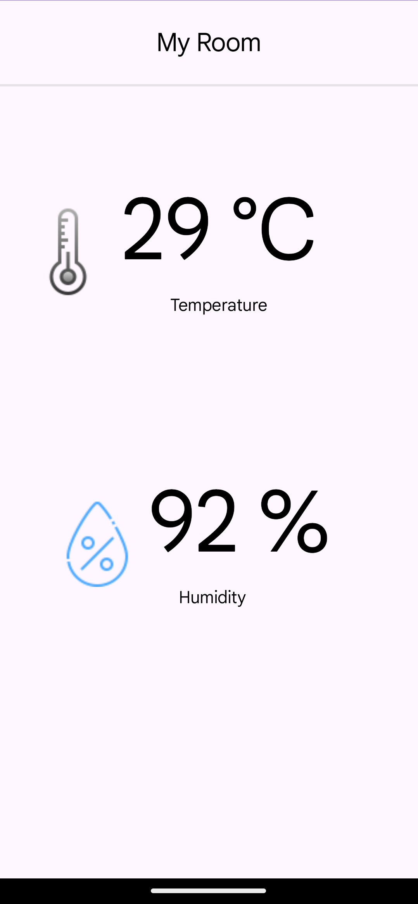

# Monitoring App for IoT Project

## Introduction
This project aims to create a monitoring application for an Internet of Things (IoT) system. The system consists of various sensors that collect temperature and humidity data, which is then displayed in the mobile application. The application provides real-time updates and historical data visualization, allowing users to monitor and analyze the environmental conditions remotely.

## Features
- Real-time display of temperature and humidity readings
- User-friendly interface for easy navigation

## Tools and Technologies Used
- NodeMCU ESP32 microcontroller
- DHT11 temperature and humidity sensor
- Arduino IDE for programming NodeMCU
- Android Studio for mobile application development
- MySQL for database management
- Retrofit for REST API communication
- PHP for backend API development
- Postman for API testing

## Screenshots

## Getting Started
To get started with the project, follow these steps:

1. Set up the NodeMCU ESP32 with the DHT11 sensor and connect it to your Wi-Fi network.
2. Install the necessary libraries in the Arduino IDE and upload the sketch to the NodeMCU.
3. Clone this repository and open the Android Studio project.
4. Build and run the Android application on your mobile device or emulator.
